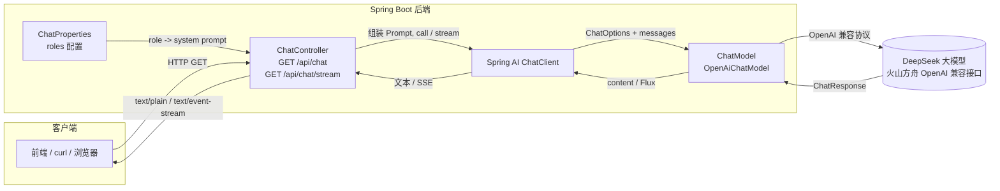
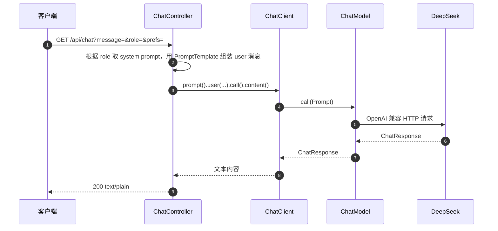

# Travel Helper · 旅行助手后端

一个基于 **Spring Boot 3 + Spring AI** 的智能旅行助手后端，接入大语言模型（DeepSeek），提供行程规划、美食推荐、翻译等能力。

---

## 1. 项目简介

Travel Helper 是一个智能旅行助手后端服务。它通过 Spring AI 的 `ChatClient` 接入大语言模型，采用「**角色 system prompt 切换**」的设计——用户通过 `role` 参数切换不同的助手身份，同时把**用户输入与偏好当作“数据”注入固定模板**，避免不可信文本污染 system prompt（防 prompt 注入）。

**核心特点**

- **多角色**：内置 `travel-advisor`（旅游规划）、`food-guide`（美食推荐）、`translator`（翻译），角色提示词在 `application.yml` 中集中配置，可自由扩展。
- **双模式输出**：同步一次性回复（`.call()`）与流式逐块输出（`.stream()` + SSE）两种接口。
- **安全边界**：system prompt 只来自受信任的配置文件；用户消息与偏好仅作为数据变量注入。

---

## 2. 技术栈

| 类别 | 技术 | 版本 |
|------|------|------|
| 语言 | Java | 21 |
| 框架 | Spring Boot | 3.5.15 |
| AI 框架 | Spring AI | 1.1.8 |
| 模型接入 | spring-ai-starter-model-openai（兼容 OpenAI 协议） | 1.1.8 |
| 大模型 | DeepSeek（火山方舟 OpenAI 兼容端点） | - |
| 构建工具 | Maven | 3.9+ |
| 测试 | JUnit 5 + Mockito + Spring Test + MockMvc + AssertJ | - |

---

## 3. 架构图

### 组件架构



### 一次请求的时序



---

## 4. 本地运行步骤

### 前置条件

- **JDK 21**（必须；Spring Boot 3.5 / Java 文本块等语法要求 21，JDK 8 会编译失败）
- Maven 3.9+
- 一个可用的火山方舟 / DeepSeek API Key

> **注意**：如果在 IDEA 中构建时报「`unclosed string literal`」「`source 8 不支持文本块`」之类的错误，通常是 Maven Runner 用了 JDK 8。请在
> `Settings → Build → Build Tools → Maven → Runner` 选择 JDK 21，并确认 `Project SDK` 也是 21。

### 步骤

```bash
# 1. 设置环境变量（Windows PowerShell）
$env:ARK_API_KEY = "你的火山方舟 API Key"
$env:TAVILY_API_KEY = "你的 Tavily API Key"

# macOS / Linux
export ARK_API_KEY="你的火山方舟 API Key"
export TAVILY_API_KEY="你的 Tavily API Key"

# 2. 启动
mvn spring-boot:run

# 3. 验证
curl "http://localhost:8080/api/chat?message=你好"
```

启动成功后默认端口 **8080**。

---

## 5. 环境变量说明

| 变量名 | 说明 | 是否必填 | 示例 |
|--------|------|:--------:|------|
| `ARK_API_KEY` | 火山方舟（Ark）API Key | ✅ 必填 | `xxxxxxxx-xxxx-xxxx` |
| `TAVILY_API_KEY` | Tavily 联网搜索 API Key | ✅ 必填（联网搜索功能） | `tvly-xxxxxx` |

### 模型相关配置（在 `application.yml` 中，非环境变量）

| 配置项 | 当前值 | 说明 |
|--------|--------|------|
| `spring.ai.openai.base-url` | `https://ark.cn-beijing.volces.com/api/v3` | 火山方舟 OpenAI 兼容端点；Coding Plan 需换成 `/api/coding/v3` |
| `spring.ai.openai.chat.completions-path` | `/chat/completions` | 覆盖默认 `/v1/chat/completions`，火山方舟正确路径 |
| `spring.ai.openai.chat.options.model` | `deepseek-v4-flash-ga-260731` | 模型名 |
| `server.port` | `8080` | 服务端口 |

---

## 6. API 文档

### 6.1 同步对话 `GET /api/chat`

一次性返回 AI 的完整文本回复。

**请求参数**

| 参数 | 类型 | 必填 | 说明 |
|------|------|:----:|------|
| `message` | string | ✅ | 用户问题 |
| `role` | string | ❌ | 角色：`travel-advisor` / `food-guide` / `translator`；不传则不带 system prompt |
| `prefs` | string | ❌ | 用户偏好（出发地、天数、预算、人数、兴趣等），作为数据注入模板 |

**响应**：`200`，`Content-Type: text/plain;charset=UTF-8`，body 为 AI 回复文本。

**示例**

```bash
# 不带角色
curl "http://localhost:8080/api/chat?message=推荐一个成都3日游行程"

# 带角色 + 偏好
curl "http://localhost:8080/api/chat?message=帮我规划行程&role=travel-advisor&prefs=出发地北京,3天,预算2000,2人,喜欢美食"
```

### 6.2 流式对话 `GET /api/chat/stream`

以 SSE（Server-Sent Events）逐块推送回复。

**请求参数**：与 `/api/chat` 完全一致。

**响应**：`Content-Type: text/event-stream`，逐块返回 AI 回复。

**示例**

```bash
curl -N "http://localhost:8080/api/chat/stream?message=介绍大阪3天行程&role=travel-advisor"
```

### 错误情况

| 状态码 | 说明 |
|:------:|------|
| 400 | `role` 不存在（`未知的角色: xxx`） |
| 500 | 模型调用异常 / 未配置 API Key 等 |

---

## 7. 已实现功能 / 待实现

### 已实现 ✅

- 多角色 system prompt 切换（`travel-advisor` / `food-guide` / `translator`），提示词配置化
- 同步一次性对话接口 `GET /api/chat`
- 流式 SSE 对话接口 `GET /api/chat/stream`
- 用户消息与偏好作为「数据」注入 `PromptTemplate`，防 prompt 注入
- 联网搜索（Function Calling）：接入 Tavily，模型可自动查景点 / 攻略 / 实时信息
- 单元测试（`@MockitoBean` mock 掉 `ChatModel`，测试接口非空 + 工具注册，无需真实调用大模型）

### 待实现 🚧

- 更多专业工具：天气、汇率、机票/酒店等结构化数据 API（如 `OpenWeatherMap`、`Amadeus`）
- 多轮对话记忆（`ChatMemory`，带历史上下文）
- 结构化输出（`beanOutput` / JSON 实体）
- 认证鉴权（API Key / JWT）
- 用户偏好 / 历史行程持久化（数据库）
- 前端界面
- Docker 化部署 / CI
- 更完整的集成测试（用 WireMock 挡 OpenAI 协议模拟两轮工具调用）

---

## 附录：开发笔记 / Notes & Lessons Learned

### 1. Spring AI 核心概念

#### 1.1 `.call()` vs `.stream()`

| 维度 | `.call()` | `.stream()` |
|------|-----------|-------------|
| 返回类型 | `CallResponseSpec` | `StreamResponseSpec` |
| 最终结果 | `String` / 对象 | `Flux<String>` |
| 阻塞行为 | 同步阻塞，等完整结果 | 非阻塞，逐块返回 |
| 首字延迟 | 高 | 低 |
| 底层 HTTP | 普通 POST | `stream=true` + SSE |
| 适用场景 | 短回复、后台任务 | 长回复、打字机效果 |

**注意**：调用 `.call()` 或 `.stream()` 本身不触发模型执行，真正的调用发生在 `.content()` / `.chatResponse()` / `.entity()` 时。

#### 1.2 `PromptTemplate` vs 拼字符串

**拼字符串的问题**：

- 可读性差，变量一多就乱
- 容易漏空格
- 无类型检查，变量名写错只有运行时才发现
- 无法复用

**用 `PromptTemplate`**：

```java
PromptTemplate template = new PromptTemplate("请用{language}回答：{question}");
Prompt prompt = template.create(Map.of(
    "language", "中文",
    "question", "什么是微服务？"
));
```

#### 1.3 什么是 Function Calling？

LLM 本身只能生成文本，无法获取实时信息（天气、汇率、数据库内容）。Function Calling 让 LLM 能「决定调用哪个函数、传什么参数」，但**实际执行由你的 Java 代码完成**。

- LLM 负责**决策**
- 你的方法负责**执行**

#### 1.4 Tool 的注意事项

| 问题 | 结论 |
|------|------|
| 工具能抛异常吗 | 能，但不推荐；内部 catch 返回友好文本更可控 |
| 返回格式有要求吗 | 推荐 String，简洁、接近自然语言；避免原始 JSON |
| 工具重名会怎样 | 会冲突，可能报错或覆盖；方法名不同或用 `name` 显式指定 |

## 1.5 Search API

- 选了：**Tavily**
- 免费额度：**1000 credit/月**（basic 搜索 1 credit/次、advanced 2 credit/次），**无需信用卡**
- 返回结构关键字段：`results[].title / url / content`（核心，喂给 LLM）；`score`（排序 + 去重）；`answer`（可选，本次未用）；`raw_content`（整页正文，默认丢弃）
- 踩坑：
  - `raw_content` 是 token 黑洞 → `include_raw_content=false`，只取 `content` 摘要
  - `query` 与 `language` 语言要一致（中文查询 + `language: zh`），召回才准
  - 同域名结果会重复 → 按域名去重、只留 `score` 最高的一条
  - 中文通用内容可用，但大陆长尾（门票/开放时间/本地新闻）召回偏弱 → 必要时用百度（SerpAPI `engine=baidu`）兜底

### 今日小结（2026-10-08）

- 修复 ChatClient 单元测试：工具执行循环在 **ChatModel 内部**（`OpenAiChatModel` 持有 `ToolCallingManager`）而非 ChatClient，mock 模型无法模拟两轮回路 → 改为断言「工具已注册并随 Prompt 传给模型」
- 完善 README：项目简介 / 技术栈 / 架构图 / 运行 / 环境变量 / API / 功能清单
- 接入 Tavily 联网搜索：`config/TavilyProperties` + `tools/WebSearchTools`，注册进 `ChatController` 的 ChatClient
- `WebSearchTools.format()` 优化：按域名去重 + 摘要按「码点安全 + 句末断句」截断（250 字）

### 遇到的问题

#### 中文 key 在 Spring 配置里不可靠

`application.yml` 中的中文 key（如 `旅游顾问:`）在用 `Environment.getProperty()` 查询时，只有第一个能命中，其他返回 `null`。

**原因**：Spring 的 PropertySource 底层是 String 匹配，中文涉及 UTF-8 编解码，不同配置源处理不一致。

**解决**：配置 key 一律用英文（`travel-advisor`、`food-guide`），中文只放在 value 里。

---